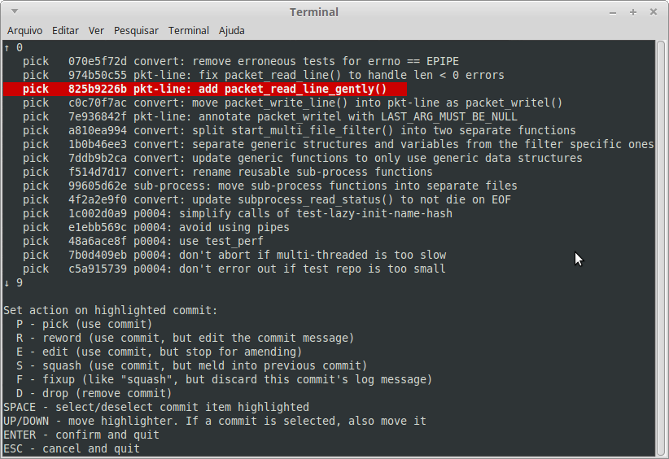

# git-reorder
A visual helper for interactive rebase.



Requires Python 3.

## Using as an interactive _git rebase_ alternative

If you want to test _git reorder_ or want to still have the option of running
interactive _git rebase_ in the traditional way, execute:

```sh
./create-alias.sh [--global] [--alias <name>]
```

This will create an alias to execute interactive _git rebase_ using this application
as the editor. The default name for the alias is `reorder`.

Then, to use it, execute the command below. Replace "`reorder`" with the name
you used for the `--alias` option above, if that is the case:

```sh
git reorder <options>
```

Most of _git rebase_ options are available - the exceptions are options used after
an interactive rebase is started (`--continue`, `--skip`, etc.) and options
incompatible with interactive mode of _git rebase_ (`--ignore-date`,
`--ignore-whitespace`, etc.).

See [git-rebase](https://git-scm.com/docs/git-rebase) documentation.


## Using as the default interactive _git rebase_ editor

To execute interactive _git rebase_ using this application as the editor, execute:

```sh
./set-editor.sh [--global]
```

This configures the default editor for interactive mode of _git rebase_.
Then, to use it, simply execute _git rebase_ the usual way:


```sh
git rebase -i [options] [--exec <cmd>] [--onto <newbase>] [<upstream> [<branch>]]
# OR
git rebase -i [options] [--exec <cmd>] [--onto <newbase>] --root [<branch>]
```

It is still possible to bypass the configuration by executing:

```sh
git -c sequence.editor='' rebase -i [options ...]

```
