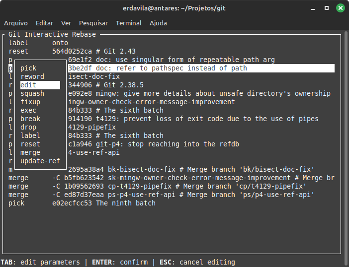

# git-interactive-rebase-editor
A visual helper for Git interactive rebase.



## Installing and building
1. Clone this repository
2. Build it with `cargo build --release`
3. Copy `./target/release/git-interactive-rebase-editor` to your desired location.

Alternativelly, use `cargo` to build and install at once:

```sh
cargo install --path <LOCAL_REPOSITORY_PATH>
```

or:

```sh
cargo install --git https://github.com/erdavila/git-interactive-rebase-editor.git
```

See the options for [`cargo install`](https://doc.rust-lang.org/cargo/commands/cargo-install.html).

## Using it

### Single use
Use the `sequence.editor` configuration when rebasing:

```sh
git -c sequence.editor=<PATH_TO_BINARY> rebase -i ...
```

### With an alias

Define an alias:
```sh
git config --global alias.rebase-i "-c sequence.editor=<PATH_TO_BINARY> rebase -i"
```

then rebase with:

```sh
git rebase-i ...
```

### Permanent use

Set the editor:

```sh
git config --global sequence.editor=<PATH_TO_BINARY>
```

then rebase with:

```sh
git rebase -i ...
```

### Platform Specifics

#### Git Bash
Start the `<PATH_TO_BINARY>` without `/` and with drive name.

E.g.: use `C:/...` instead of `/c/...`.

#### Cygwin
Cygwin requires the `git-interactive-rebase-editor.sh` adapter script to ensure that the editor receives a path in Windows format.

1. copy [`git-interactive-rebase-editor.sh`](./git-interactive-rebase-editor.sh) to the same place where the binary is located;
2. in the commands above, for `<PATH_TO_BINARY>` use the path to `git-interactive-rebase-editor.sh` instead of the path to the binary.
